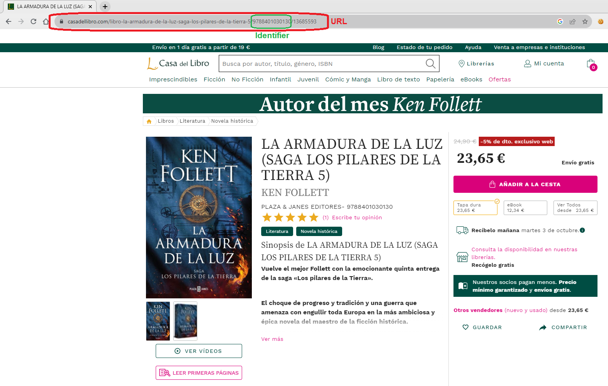

# Building a basic Web Scraper

## Step-by-step guide to creating a basic Web Scraper

<b>Web Scraping</b> refers to the automated process of extracting data from web pages using software tools or scripts. Typically, the goal is to compile a dataset, conduct analysis or to performe research.
In this repository I have crafted a straightforward <b>Python</b> script that leverages the Selenium and BeautyfulSoup libraries to gather book-related information from the "La Casa del Libro" website. 
</br>
To build this bot Web Scraper, it's essential to delineate its core components:
1. <b>Web Crawling:</b> This phase involves the retrieval of pertinent URLs of interest.
2. <b>HTML Parsing:</b> Here, we dissect the HTML structure of these pages and extract their content.
3. <b>Data Extraction:</b> The final step entails extracting the specific data of interest from the HTML code.

This project exemplifies the seamless integration of these components to facilitate data retrieval and analysis.

[](https://www.youtube.com/watch?v=LVZoU1unKLk&ab_channel=SergiS%C3%A1nchezHern%C3%A1ndez)


## Dependencies
The Packages we have used are:
- Pandas==2.0.1
- Selenium==4.13.0
- Requests==2.27.1
- BeautifulSoup==4.11.1

## Web Crawling
The initial step to create a scraper bot is to collect all the URLs from which we intend to gather information. To acomplish this, we'll develop a Crawler bot that will automatically retrieve these URLs for us. </br>
A web crawling , in essence, acts as a digital cartographer, mapping the intrincate network of routes and URLs within a website. It systematically records these paths, therefore enabling the acces of each one by the scraper bot for the data extraction.
</br>
</br>
### DFS - Search Algorithm

To navigate the entire route tree of the website, we will employ the DFS (Depth First Search) algorithm. This algorithm systematically explores the entire route tree, thoroughly traversing each path to its leaf node, ensuring comprehensive coverage.

```python
    #Pseudo-code of the DFS algorithm
    def dfs(url, visited):
        #Add current URL to the visited list
        visited.append(url)

        #HTTP Request of the URL to retrieve the HTML content
        response = requests.get(url)
        if response.status_code == 200:
            
            #Parse HTML
            soup = BeautifulSoup(response.text, 'html.parser')

            #Find all the links in the HTML
            links = soup.find_all('a', href=True)

            #Iterate each link
            for link in links:

                #Extract href attribute of a tag
                next_url = link['href']
                if next_url not in visited:

                    #Recursive call
                    crawl(next_url, visited)
                        
```
In this pseudo-code, we represent the fundamental structure of the DFS algorithm for our crawler bot. This recursive function serves as a means to gather all web links and delve deep into the branches. To acquire the HTML content of a URL, we beign by issuing a GET HTTP request using the Requests library, and then initialize a BeautyfulSoup object with its result to access to the content for further processing.
### Pattern Matching
In order to create a web scraper, it's crucial to analyze the web's patterns for exploitation. This analysis is equally significant for our crawler bot. In our specific case, our objective is not to traverse every corner of the web but rather to focus exclusively on routes containing book-related data. By filtering and retaining only these URLs, we can efficiently skip those that do not align with our interests, saving resources and time.
<div align="center">
    
</div>
In our scenario, we've identified that URLs containing book-related data consistently incorporate a 13-digit identifier. Therefore, we can employ pattern matching on the URLs to selectively retain them.

```python
    #This patter matching requires to have 13 numbers inside the string/URL
    books_matching = r'\d{13}'

    #Extract href attribute of a tag
    next_url = link['href']
    if next_url not in visited:
        # Apply the pattern matching and store the URL
        if re.search(books_matching, next_url) and next_url not in save_urls:
            save_urls.append(next_url)
```

### Bot Crawler Considerations

#### Limit URLs and Depth
In order to speed up this program and prevent the accumulation of an excessive number of URLs for scraping (as this process can be time-consuming) two limitations can be applied:

- Set a cap on the maximum number of URLs to be collected.
- Restricted the depth at which the URL tree can be explored. We have tried with depth 2 and 3 (being 0 the seed node).

These parameters can be adjusted based on your preferences, but it's essential to bear in mind that delving deeper into the tree and collecting more URLs will result in longer execution time for the crawler bot. In the results section you'll get an idea of the time cost adjusting the depth.

#### Relative URLs
We must also keep in mind that within most web pages, the URLs found within the tags are often relative URLs. </br>
To handle this, it is important to add the base URL of the web page to each value of the tags along with the URLs that form the path.

```python
    base_url = "https://www.casadellibro.com"
    anchor_url = "/books"
    new_base_url = base_url + anchor_url 
    new_base_url
    "https://www.casadellibro.com/books"
```
There will be also absolute URLs or URLs that are relative to the index page, not the current. As we have said, it is important to analyse carefully the web to exploit, since in this case the books related URLs will be relative to the index page, and they have some features in common. 
#### Final Code
```python
    #Constants
    books_matching = r'\d{13}'
    base_url = "https://www.casadellibro.com"
    
    def crawl(url, visited, depth_limit, save_urls):
        #Cap the maximum number of urls to save
        if depth_limit == 0 or len(save_urls) >=1000: 
            return
            
        #Add current URL to the visited list
        visited.append(url)

        try:
            #HTTP Request of the URL to retrieve the HTML content
            response = requests.get(url + '/')
            if response.status_code == 200:

                #Parse HTML
                soup = BeautifulSoup(response.text, 'html.parser')

                #Find all the links in the HTML
                links = soup.find_all('a', href=True)

                #Iterate each link
                for link in links:

                    #Extract href attribute of a tag
                    next_url = link['href']

                    #Check that the URL is valid or it is not already visited
                    if len(next_url) > 0 and len(next_url) < 120 and next_url not in visited:

                        #Chech if its a relative URL (/libro-title-example...)
                        if next_url.startswith('/'):

                            #Check if the URL is our target by:
                            # pattern matching
                            # checking that is not already saved
                            # checking the word 'libro' in the URL (all have in common)
                            if re.search(books_matching, next_url) and base_url + next_url not in save_urls and 'libro' in next_url:
                                
                                #Saving the index path concatenated with the relative path
                                save_urls.append(base_url + next_url)
                            else:
                                #Recursive Relative URL
                                crawl(base_url + next_url, visited, depth_limit - 1, save_urls)
                        
                        #Recursive Absolute URL
                        else:
                            crawl(next_url, visited, depth_limit - 1, save_urls)
                            
        except Exception as e:
            print(f"Error crawling {next_url}: {str(e)}")
```

## HTML Parsing
As you have seen in the crawler bot, we have used the BeautyfulSoup to fetch and parse the HTML content, enabling us to locate <b>`<a>`</b> tags and extract their <b>`href`</b> attribute. However, when dealing with the scraper bot, we encounter a different scenario. In the case of the 'La Casa del Libro' website, book information isn't readily available in the original HTML source; instead, it's dinamically generated using JavaScript files.</br>
To overcome this challenge, we'll employ the <b>Selenium</b> library, which enables us to launch a browser instance, navigate to the URLs, and collect data once the page has fully loaded.
```python
    def scrap(urls):
        for url in urls:
            options = webdriver.ChromeOptions()
            #Exclude errors in the terminal
            options.add_experimental_option('excludeSwitches', ['enable-logging'])
            browser = webdriver.Chrome(
                options = options 
            )
            #Open a Chrome instance with the url 
            browser.get(url)
            try:
                #Extract data
                #
                #
                #Close Chrome Instance
                browser.quit()
            except selenium.common.exceptions.NoSuchElementException:
                browser.quit()
                continue

        return dataframe
```
Using this code, each URL will trigger the opening of a Chrome instance, facilitating data extraction. </br> When executing this code on any of the URLs, you can expect the following:
<div align="center">
    
</div>
Upon opening the page, a cookie consent popup will appear, impeding data extraction until it's acknowledged with a click. To handle this, Selenium provides a handy function that automates the clicking of the popup, given the element to be clicked. 

```python
    myElem = WebDriverWait(browser, 20).until(EC.element_to_be_clickable((By.CSS_SELECTOR, 'button#onetrust-accept-btn-handler')))

```

## Data Extraction
The final step involves data extraction, which necessitates identifying specific patterns withing the HTML structure where the data resides.
</br>
Patterns Uncovered:

- Price: The element containing prices can either be a `<span>` or `<strong>` element, both of which share the class attribute `'text-h4 font-weight-bold'`.
- Title: This corresponds to the `<h1>` element, which is unique for each page.
- Author: The element housing the author information is identified by the class `'text--darken-1'`.

The process to extract data from each website is different, in this case we have used both the h1 element and the element classes, since the website uses bootstrap to provide styles through classes. You have to be very careful about the classes, since it could be that these were in other elements and would not return the data that we want. 
The process of data extraction can vary from one website to another. In our case, we've leveraged both the `<h1>` element and class attributes, as the website utilizes Bootstrap for styling through these classes. Careful attention to these classes is imperative, as theu could be assigned to other elements and potentially lead to unintended data retrieval. For that reason, it is very important to find unique ways to identify the elements where the data resides.
</br>
</br> 
Below is the final code of the Scraper Bot:
```python
#Scraper bot code
def scrap(urls, dataframe):
    for url in urls:
        options = webdriver.ChromeOptions()
        options.add_experimental_option('excludeSwitches', ['enable-logging'])
        browser = webdriver.Chrome(
            options = options 
        )
        browser.get(url)
        try:
            myElem = WebDriverWait(browser, 20).until(EC.element_to_be_clickable((By.CSS_SELECTOR, 'button#onetrust-accept-btn-handler')))
            try:
                price = browser.find_element(By.CSS_SELECTOR, ".text-h4.font-weight-bold").text
                author = browser.find_element(By.CLASS_NAME, "text--darken-1").text
                title = browser.find_element(By.CSS_SELECTOR, "h1").text
                print({"Title": title, "Author": author, "Price": price})
                dataframe.loc[len(dataframe)] = [title, author, price]                
                browser.quit()
            except selenium.common.exceptions.NoSuchElementException:
                browser.quit()
                continue
        except selenium.common.exceptions.NoSuchWindowException:
            browser.quit()
            continue

    return dataframe
```
Effective error management is crucial in this contents. In  the event that the script encounters an error, we aim for it to gracefully handle the situation without halting its execution. Even if the desired data is not found on a particular URL, the bout should move on the next URL to scrape.
</br>
In this case we have managed the situations where the cookies acceptance popup doesn't appear (alhough it should appear always), and when the scrape doesn't found the desired data with the corresponding selectors.

## Final Considerations

### Bot Crawler Problems
A significant portion of this project development time was dedicated to the crawler bot. This was primarily due to the following challenges:

- Absolute and Relative Routes: Within the website, routes can vary in complexity, with some delving deeper into the route tree while others ascend.  Managing both absolute and relative routes posed a complex navigation challenge.
- Route Loops: The same route can appear on multiple pages or URLs, potentially leading to indefinitve loops. Although this issue can be resolved by tracking visited routes, it becomes mores intrincate when combined with the absolute/relative routes dilemma, adding to the computational cost.

### Scraping Limitations
Corporate wensites, in particular, employ measures to deter data scraping due to concerns over data privacy and security. These limitations include:

#### CORS Problem
A common hurdle encountered is the Cross-Origin Resource Sharing (CORS) issue. Websites implement this security measure to restrict browser-originated requests to the same domain that served the web page. Consequently, when attempting to retrieve a website's HTML content, CORS errors may prevent access to the source code. One practical solution involves setting up a proxy server to act as an intermediary between our scraper and the target website.

#### IP Blocking
IP Blocking presents another common challenge. Websites may temporarily block our IP address if they perceive our scraping activity as excessive or prejudicial. Although these blocks are tipycally temporary, they can disrupt data collection. Similar to the CORS issue, IP blocking can be mitigated through the use of proxy servers or VPNs, which provide alternative IP addresses for scraping tasks.

## Results 
Una vez tenemos el crawler bot que nos devuelve las URLs, y el scraper bot para extraer la información, ya tenemos un web scraper funcional. 
### Crawler Bot
El tiempo de ejecución del bot crawler varia dependiendo de la profundidad del árbol de rutas que queremos visitar. Hemos realizado tres ejecuciones con diferentes valores de profundidad:

|Tree Depth|Execution Time|URLs retrieved|
|----------|:------------:|:------------:|
|1         |0.326s        |84            |
|<b>2</b>         |<b>675s(11min)</b>  |<b>4910</b>          |
|3         |12hours(stopped exec.)     |8000  |

You can see that there is a big difference in the time cost chosing the tree depth to explore. Despite the fact that for the last case we have decided to end its execution, it takes much longer to execute than the previous depth, and the URLs obtained do not increase as much as the time needed. 

### Scraber Bot
We have not scraped the 4910 URLs that we obtained from the crawler, because the time need it to scrap one page is longer than to fetch it. After all, we are launching a browser instance and loading a web page. </br>
To scrap data from <b>200 URLs</b>, the time consumed by the bot was <b>3020 seconds(50 minutes)</b>, giving us that for each URL needs 15 seconds to extract its information. 


## Next Steps ⏩
To enhance the effectiveness and reduce time execution of this web scraping script, consider implementing the following improvements:

- [ ] Improve the Crawler bot search algorithm, using heuristics that allow pruning unnecesary search paths.
- [ ] Build a proxy server to avoid possible connectivity problems.
- [ ] Use a different strategy in the scraper bot than having to open an instance of a browser.
## Getting Started
### Installation
To ensure the successful installation of this project and its dependencies, it is essential to have both <b>Git</b> and <b>pip</b> already installed.
</br></br>
Clone this repository:
```bash
git clone https://github.com/sergissh/Basic-Web-Scraper.git
cd Basic-Web-Scraper
```
Install the dependencies:
```bash
pip install -r requirements.txt
```
The project is now ready to use!

### Usage
Execute the scraper:
```bash
python main.py
```


## Links 🔗
- <a href="https://eloquent-rugelach-c4e65d.netlify.app/">My Web Personal Portfolio</a>
- <a href="https://www.youtube.com/watch?v=LVZoU1unKLk&ab_channel=SergiS%C3%A1nchezHern%C3%A1ndez">How the scraper bot works video</a>